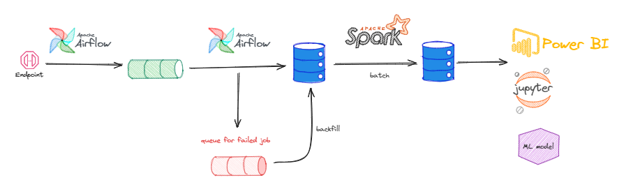
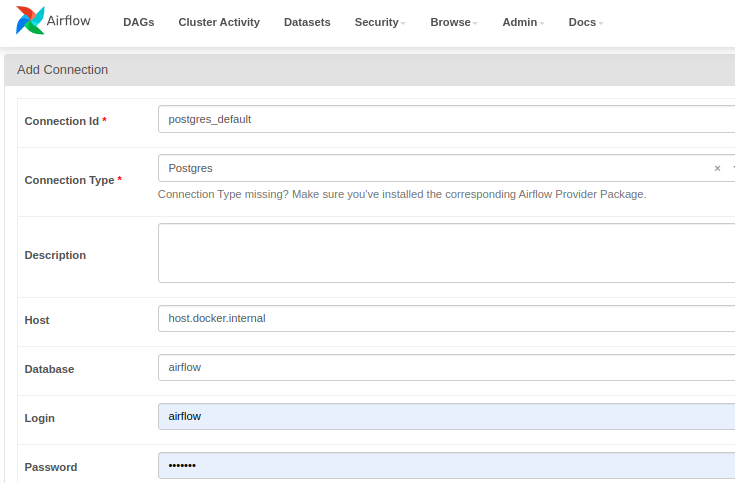
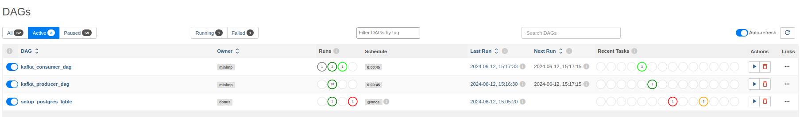
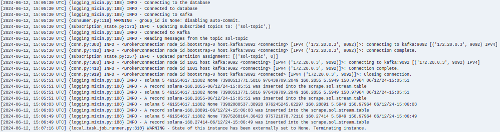
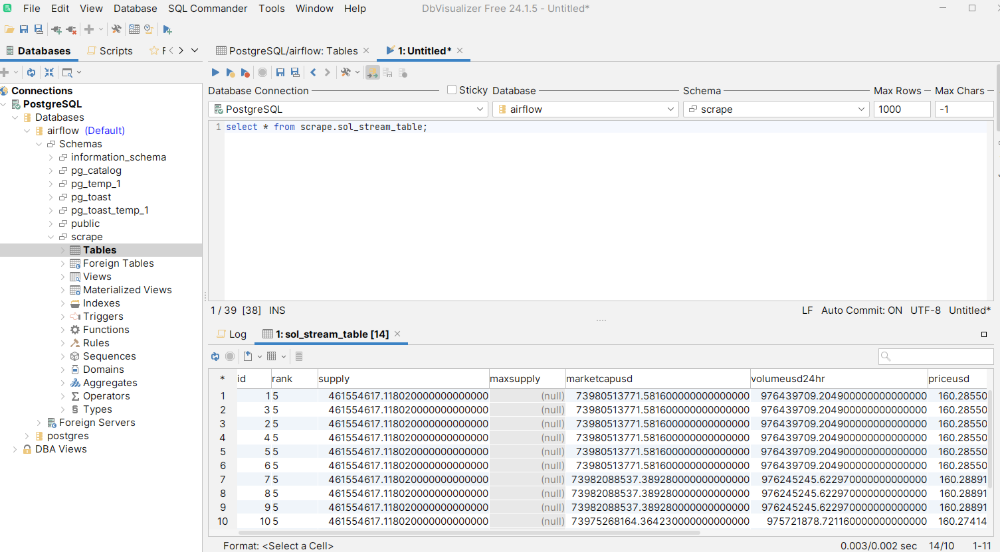

## Simple Scraping Crypto Pipeline with Airflow-Kafka-Postgres



- Dev Infras:
  - OS : Ubuntu 22.04
  - RAM >= 20GB
- Tech stack:
  - Source: coinmarketcap API
  - Semantic: Kafka
  - Orchestration: Airflow
  - Backend: Python
  - Datalake tier: Postgres
  - Frontend: Superset (TBD)

### Setup

#### 1. Kafka-Airflow-Postgres
```commandline
docker compose up -d
```
#### 2. Superset
```commandline
git clone https://github.com/apache/superset.git
cd superset
git checkout 3.0.0
TAG=3.0.0 docker compose -f docker-compose-non-dev.yml up -d
docker compose logs -f
```
#### 3. Port & User/Password
- airflow: localhost:8080 (airflow/airflow)  
- kafka-ui: localhost: 8000
- superset: localhost:8088 (admin/admin)

### Play
#### 1. Setup Postgres connection
Steps: airflow-ui -> admin -> connection -> add a record


#### 2. Run jobs
Steps: Dag dashboard -> Search Dag -> Trigger

The log of consume kafka might be like this

#### 3. Checkout some data
In this context, i use [dbvisualizer](https://www.dbvis.com/installation-instructions/) (cuz its free)

#### 4. Dashboard
To be updated


Notice:
- **Kafka Consumer inside airflow use: 9092 (communication between 2 images inside a container)**